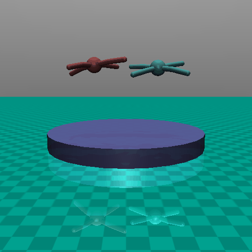
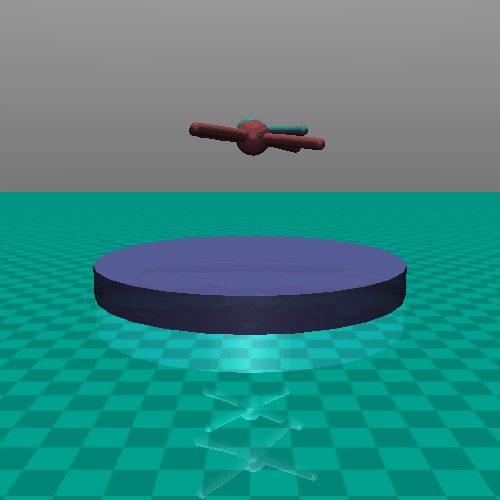

# GEnetic-Multiagent-Selfplay
Official Repo for the Paper, Genetic Algorithm for Curriculum Design in Multi-Agent Reinforcement Learning (Song et al, 2024)(https://openreview.net/pdf?id=2CScZqkUPZ)


 

Our agent trained by GEnetic-Multiagent-Selfplay (Blue) playing against agent trained by MAESTRO (Samvelyan et al, 2023) (Red)



Our agent trained by Genetic-Multiagent-Selfplay with 1.5 billion steps (Blue) against agent trained by OpenAI (Bansal et al, 2017)


# Contents
This is the repo for the paper was published in Conference on Robot Learning (CoRL) 2024. In this repo, we include the two following items.

- Code to run the algorithm
- Weights from a model we have trained up to 1.5 billion steps interacting with the Mujoco Environment, to be used as possible future benchmark. Against the OpenAI's model, this model wins 50.9%, ties 11.9%, loses 37.2%

# To Install
Simply install multiagent-competition (https://github.com/openai/multiagent-competition, Bansal et al, 2017) with PyTorch. This package was used with PyTorch 2.2.0

# To Run the training
```bash
python main.py --train 1 --num-proc
```

# To Play Trained Model
```bash
python main.py --train 0
```


